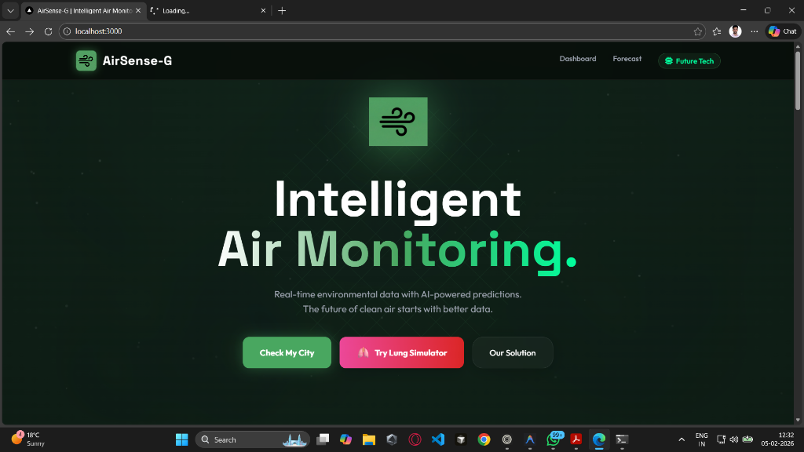
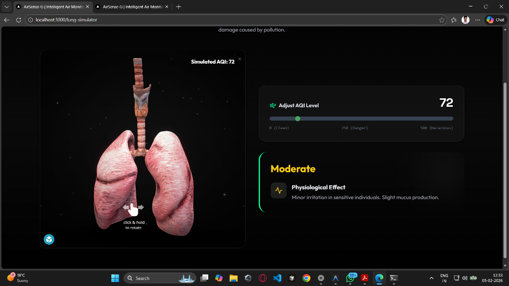
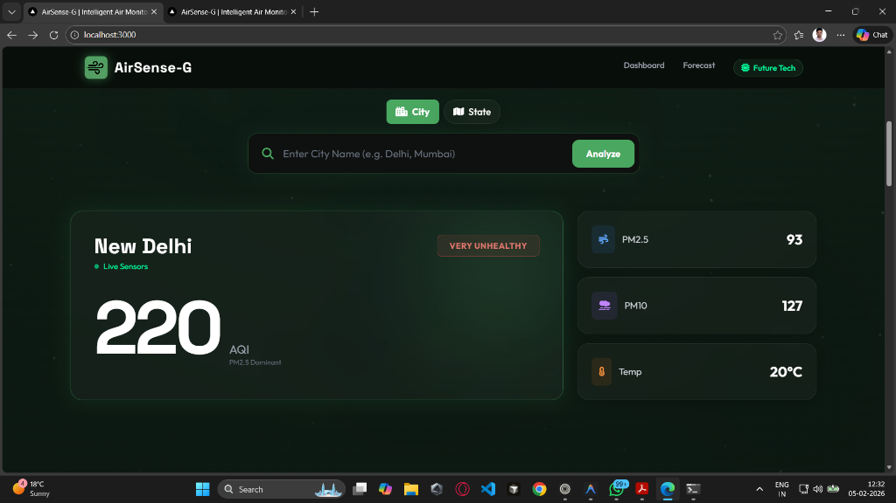

# 🌬️ AirSense Guardian

**"From Awareness to Action"**


AirSense Guardian is a community-driven air quality intelligence system. It doesn't just show you the air quality index (AQI)—it identifies **pollution sources** and suggests **high-impact actions** to help you breathe easier.

---

## 🚀 Key Features

<table>
  <tr>
    <td width="33%">
      <h3 align="center">Real-Time Monitoring</h3>
      <div align="center">Hyperlocal AQI, PM2.5, & NO₂ tracking with live maps.</div>
      <br />
      <div align="center"></div>
    </td>
    <td width="33%">
      <h3 align="center">Live Lung Simulator 🫁</h3>
      <div align="center">Interactive 3D model showing the visible impact of pollution on lungs.</div>
      <br />
      <div align="center"></div>
    </td>
    <td width="33%">
      <h3 align="center">Action Engine ⚡</h3>
      <div align="center">"Carpooling now reduces AQI by 12%." Data-driven recommendations.</div>
      <br />
      <div align="center"></div>
    </td>
  </tr>
</table>

- **🔍 Source Attribution**: Know if pollution is from traffic, industry, or crop burning.
- **🔮 Predictive AI**: Forecasts AQI for the next 3-6 hours.
- **🛡️ Health Alerts**: Instant warnings for sensitive groups.

---

## 🛠️ Tech Stack

### Frontend


### Backend


---

## ⚡ Quick Start

Get up and running in **2 minutes**.

### 1. **Clone the Repo**
```bash
git clone https://github.com/Daksha009/AirSense-Guardian.git
cd AirSense-Guardian
```

### 2. **Start Everything (Windows)**
Simply run the startup script:
```cmd
.\start_all.bat
```
This launches both the **Backend** (port 5000) and **Frontend** (port 3000).

### 3. **Manual Start (Optional)**
<details>
<summary>Click to see manual commands</summary>

**Backend:**
```bash
cd backend
pip install -r requirements.txt
python app.py
```

**Frontend:**
```bash
cd frontend
npm install
npm start
```
</details>

---

## 📖 Documentation

For in-depth guides, check the [`docs/`](docs/) folder:

- [📄 Detailed Project Guide](docs/Project_Details.md) - Architecture & API details.
- [🧠 Model Training Guide](TRAINING_GUIDE.md) - How we trained the ML predictor.
- [🎨 UI/UX Design System](frontend/UI_UX_DESIGN.md) - Design principles & palette.

---

<p align="center">
  Built with ❤️ for cleaner air. <br>
  <strong>Hackathon 2025</strong>
</p>
